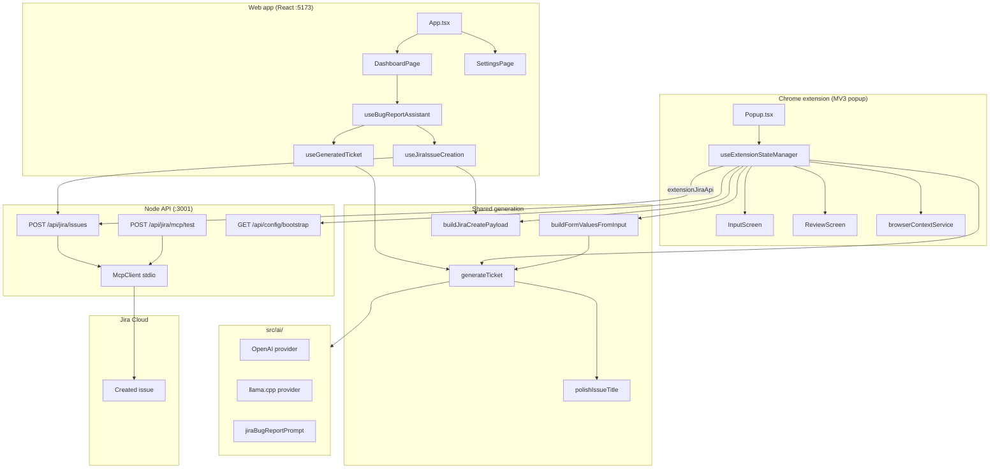
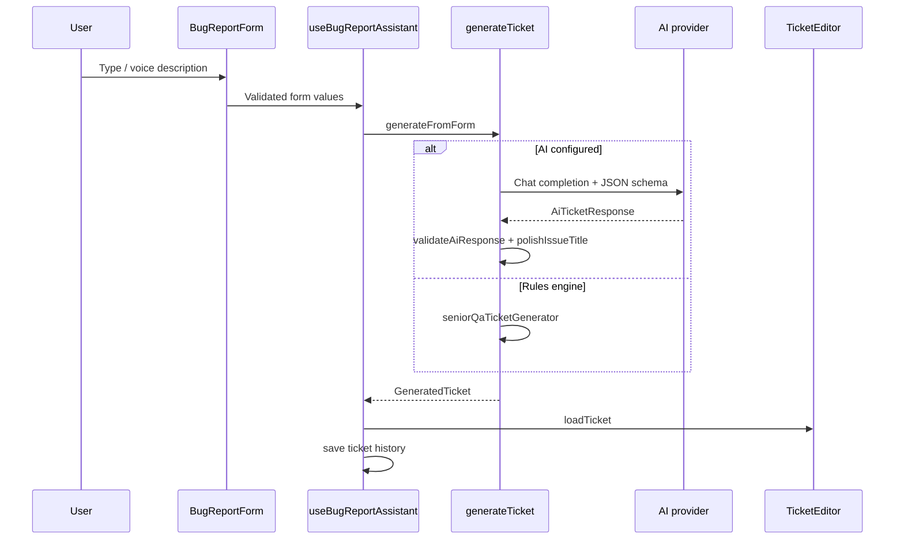
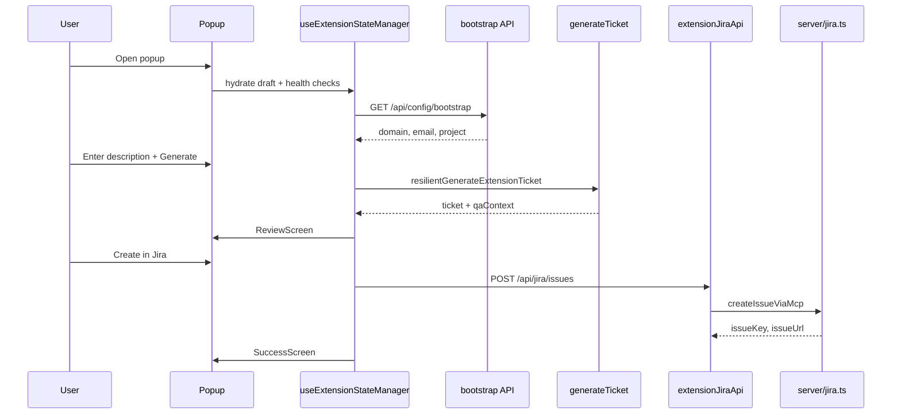
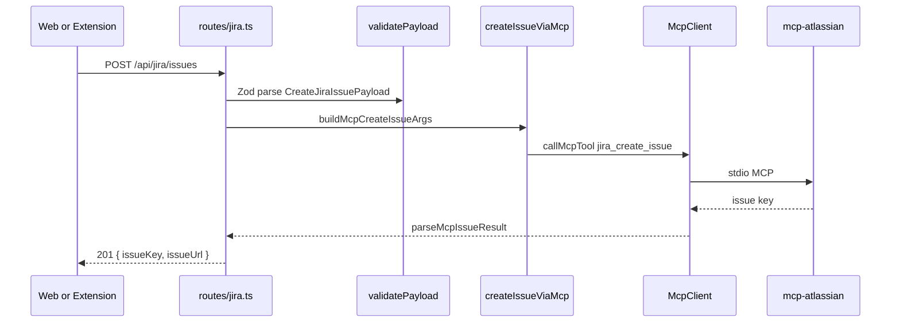
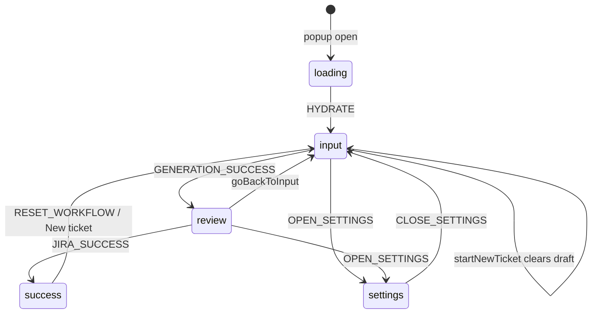

# QA Bug Assistant — Architecture Graphs

## System overview

## Web app ticket generation sequence

## Extension popup sequence

## Jira create via MCP

## Extension state views

## File → responsibility matrix

| Path | Responsibility |
|------|----------------|
| `src/pages/DashboardPage.tsx` | Web main workflow UI |
| `src/hooks/useBugReportAssistant.ts` | Web orchestration |
| `src/services/ticketGeneration/index.ts` | `generateTicket()` entry |
| `src/utils/polishIssueTitle.ts` | Formal title grammar + context |
| `src/utils/buildJiraCreatePayload.ts` | Client → API payload |
| `src/extension/popup/Popup.tsx` | Extension view router |
| `src/extension/hooks/useExtensionStateManager.ts` | Extension orchestration |
| `src/extension/state/extensionStateReducer.ts` | Popup state machine |
| `server/src/routes/jira.ts` | Jira HTTP endpoints |
| `server/src/jira/createIssueViaMcp.ts` | MCP tool argument mapping |
| `server/src/mcp/McpClient.ts` | Stdio MCP transport |
| `shared/jiraApi.ts` | Shared request/response types |
| `shared/generation/` | TicketContext, compose description |
| `about/about.html` | About + structure overview |
| `graphify/project-structure.mmd` | Module dependency graph |
