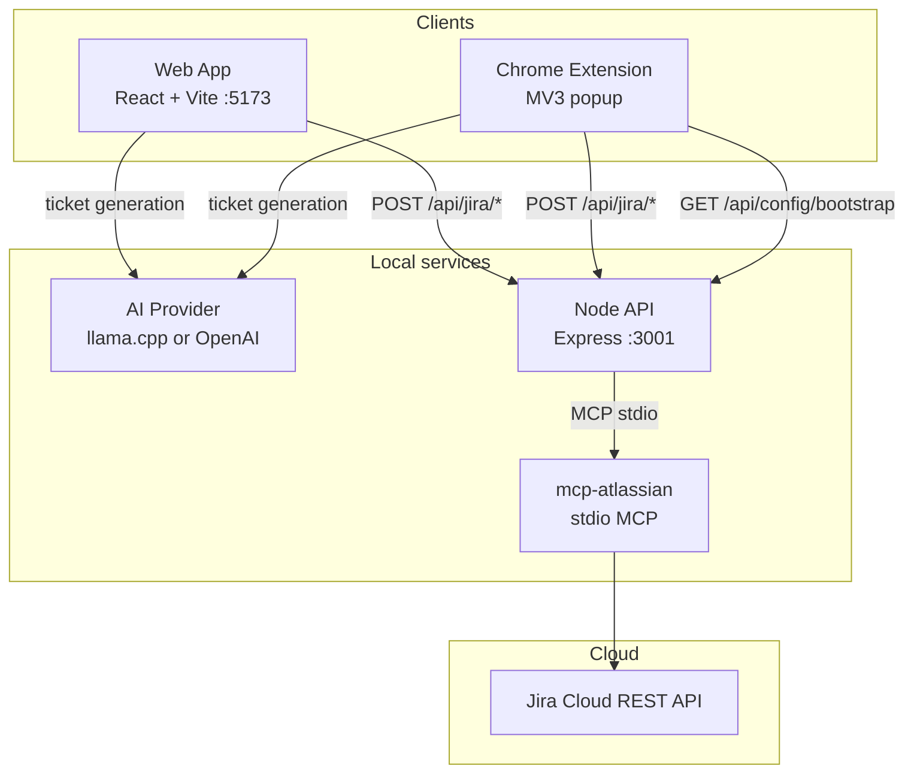

# QA Bug Report Assistant

A QA-focused toolkit for creating **Jira-ready bug tickets in under one minute**. Describe a bug by typing or voice, let AI structure the ticket, review and edit, then create the issue in **Jira Cloud** via MCP.

The project has two clients that share the same backend and generation logic:

| Client | Purpose |
|--------|---------|
| **Web app** | Full dashboard — history, settings, templates, LAN sharing |
| **Chrome extension** | Capture bugs from any tab — page URL/title, popup workflow |

**Version:** `1.2.2`

---

## Table of contents

1. [What it does](#what-it-does)
2. [Architecture](#architecture)
3. [Project structure](#project-structure)
4. [Tech stack](#tech-stack)
5. [Prerequisites](#prerequisites)
6. [Quick start](#quick-start)
7. [Chrome extension](#chrome-extension)
8. [Configuration](#configuration)
9. [Documentation](#documentation)
10. [Scripts reference](#scripts-reference)
11. [Testing](#testing)
12. [Security](#security)
13. [Out of scope](#out-of-scope)
14. [Version history](#version-history)

---

## What it does

### End-to-end workflow

```
Describe bug (type or voice)
        ↓
AI + rules engine → structured ticket
        ↓
Review & edit (title, steps, severity, Jira fields)
        ↓
Create issue in Jira Cloud (via API + MCP)
```

### Web app features

- Voice dictation (Web Speech API) with environment detection
- AI ticket generation (local **llama.cpp** or **OpenAI**)
- Editable preview, title suggestions, confidence score
- QA context detection (browser, OS, device)
- Ticket history, templates, QA standards engine
- One-click Jira creation from the dashboard

### Chrome extension features

- Popup on any page — captures **URL**, **title**, timestamp
- Optional **include/exclude page title** in the ticket
- Same AI generation and Jira creation as the web app
- Draft persistence across popup closes
- Keyboard shortcut: **Ctrl+Shift+B** (customizable in Settings)
- Auto-syncs Jira domain and project from `server/.env`

---

## Architecture

### System overview



### Request flow — Jira issue creation

```
Browser / Extension
    │  POST /api/jira/issues  (ticket payload + optional connection)
    ▼
Express API (server/)
    │  validate payload (Zod)
    │  build MCP tool arguments
    ▼
MCP Client (stdio transport)
    │  spawn mcp-atlassian child process
    │  call jira_create_issue
    ▼
Jira Cloud
    │  returns issue key + URL
    ▼
201 { issueKey, issueUrl }
```

**Credentials never live in the frontend bundle.** Jira API tokens are read from `server/.env` or sent per-request to the API only (extension/web Settings).

### Shared code

Both clients reuse the same modules where possible:

| Shared module | Used for |
|---------------|----------|
| `shared/jiraApi.ts` | API contract (create issue, MCP test) |
| `shared/generation/` | Browser context, issue description composition |
| `src/services/ticketGeneration/` | AI + rules-based ticket generation |
| `src/utils/buildJiraCreatePayload.ts` | Jira create payload from ticket + settings |

The extension adds MV3-specific layers under `src/extension/` (popup, `chrome.storage`, health checks, bootstrap sync).

### Data storage

| Data | Web app | Extension |
|------|---------|-----------|
| Settings | `localStorage` | `chrome.storage.local` |
| Drafts / history | `localStorage` | `chrome.storage.local` |
| Jira credentials (preferred) | `server/.env` | `server/.env` (auto-synced) |
| Theme | `localStorage` | N/A |

---

## Project structure

```
jira-ticket-generator/
│
├── src/                          # React web application
│   ├── ai/                       # Prompts, providers (llama.cpp, OpenAI), schemas
│   ├── components/               # UI — forms, ticket preview, settings, history
│   ├── hooks/                    # Voice, form state, Jira creation, theme
│   ├── pages/                    # Dashboard, Settings
│   ├── services/                 # Ticket generation, Jira client, history, memory
│   ├── utils/                    # Context detection, voice, Jira formatting
│   └── extension/                # Chrome extension (MV3)
│       ├── popup/                # React popup UI
│       ├── background/           # Service worker (shortcuts)
│       ├── components/           # Input, Review, Settings, Success screens
│       ├── services/             # Bootstrap sync, Jira API, drafts, health
│       ├── state/                # Unified extension state reducer
│       └── manifest/             # manifest.json template
│
├── server/                       # Node.js API backend
│   └── src/
│       ├── routes/
│       │   ├── jira.ts           # POST /issues, POST /mcp/test
│       │   └── config.ts         # GET /bootstrap (extension sync)
│       ├── jira/                 # Payload validation, MCP issue creation
│       ├── mcp/                  # MCP stdio client, connection test
│       ├── app.ts                # Express app + CORS
│       └── config.ts             # Environment config
│
├── shared/                       # Types shared by web, extension, and API
│   ├── jiraApi.ts                # Create issue + MCP status contracts
│   ├── extensionBootstrap.ts     # Extension bootstrap response type
│   ├── generation/               # TicketContext, composeIssueDescription
│   ├── qaTicketStandards.ts
│   └── ticketTemplate.ts
│
├── about/                        # About page (web + extension)
├── graphify/                     # Mermaid architecture diagrams
├── .cursor/skills/qa-bug-assistant/  # Agent skill (architecture, workflows)
├── scripts/                      # Dev lifecycle (PowerShell), MCP setup, verify
├── docs/                         # Detailed guides (see Documentation)
├── dist-extension/               # Extension build output (gitignored)
└── vite.extension.config.ts      # Extension-specific Vite config
```

---

## Tech stack

### Frontend (web + extension popup)

| Layer | Technology |
|-------|------------|
| UI | React 19, TypeScript 6 |
| Build | Vite 8 |
| Styling | Tailwind CSS v4 (web app) |
| Voice | Web Speech API |
| Testing | Vitest |

### Backend API (`server/`)

| Layer | Technology |
|-------|------------|
| Runtime | Node.js (ES modules) |
| Framework | Express 5 |
| Validation | Zod |
| Testing | Vitest + Supertest |

### Integrations

| Integration | Technology |
|-------------|------------|
| Jira | MCP stdio → **mcp-atlassian** → Jira Cloud |
| AI (local) | **llama.cpp** (OpenAI-compatible HTTP API) |
| AI (cloud) | OpenAI Chat Completions |
| Extension | Chrome Manifest V3 |

---

## Prerequisites

| Requirement | Required for |
|-------------|--------------|
| **Node.js 20+** | Web app, API, extension build |
| **npm** | All installs and scripts |
| **Python + mcp-atlassian** | Jira issue creation (`npm run mcp:install`) |
| **llama.cpp** (optional) | Local AI without OpenAI |
| **Chrome** | Extension (Load unpacked) |

---

## Quick start

### Option A — Web app only (no Jira)

```bash
npm install
npm run dev
```

Open **http://localhost:5173**

Ticket generation works if AI is configured (llama.cpp or OpenAI). Jira creation requires the API (Option B).

### Option B — Full stack (web app + Jira)

**Terminal 1 — API:**

```bash
npm run api:install
cp server/.env.example server/.env    # add Jira + MCP credentials
npm run mcp:install                   # pip install mcp-atlassian
npm run api:dev                       # http://localhost:3001
```

**Terminal 2 — Frontend:**

```bash
npm install
npm run dev                           # http://localhost:5173
```

Or restart both:

```bash
npm run dev:restart
```

Verify Jira: **Settings → Jira Integration → Test API & MCP connection**

Detailed setup: [docs/JIRA_MCP_SETUP.md](docs/JIRA_MCP_SETUP.md)

### Option C — Local AI (llama.cpp)

1. Install [llama.cpp](https://llama-cpp.com/download/) and add `llama-server` to PATH.
2. Start the model server:

```bash
npm run llama:server
```

3. Copy `.env.example` → `.env.local`:

```env
VITE_AI_PROVIDER=llama-cpp
VITE_LLAMACPP_BASE_URL=http://127.0.0.1:8080/v1
VITE_LLAMACPP_MODEL=qwen2.5-3b-instruct
```

4. Run `npm run dev` (and `npm run api:dev` if using Jira).

---

## Chrome extension

### Build and load

```bash
npm run extension:release    # test + build + verify (recommended)
```

Output: **`dist-extension/`**

1. Start API: `npm run api:dev`
2. Open [chrome://extensions/](chrome://extensions/) → **Developer mode**
3. **Load unpacked** → select `dist-extension/`

Pre-built zip (optional): `qa-bug-assistant-extension-v1.2.2.zip`

### Extension + Jira

The extension uses the **same API and `server/.env`** as the web app:

- Jira token stays on the server (not in the extension bundle)
- On popup open, domain/email/project sync from `GET /api/config/bootstrap`
- Leave Jira fields blank in extension Settings if `server/.env` is configured

**Daily workflow:**

```bash
npm run api:dev    # keep running
# use extension from any tab
```

Extension docs: [docs/extension/README.md](docs/extension/README.md)

---

## Configuration

### API server (`server/.env`)

| Variable | Description |
|----------|-------------|
| `JIRA_URL` | e.g. `https://company.atlassian.net` |
| `JIRA_USERNAME` | Atlassian account email |
| `JIRA_API_TOKEN` | From [id.atlassian.com](https://id.atlassian.com) |
| `JIRA_DOMAIN` | e.g. `company.atlassian.net` (browse URLs) |
| `JIRA_DEFAULT_PROJECT_KEY` | Default project (e.g. `QA`) |
| `MCP_SERVER_COMMAND` | Default: `mcp-atlassian` |
| `JIRA_MCP_MOCK` | `true` = fake `QA-123` without MCP |

### Web app (`.env.local`)

| Variable | Description |
|----------|-------------|
| `VITE_AI_PROVIDER` | `llama-cpp`, `openai`, or `auto` |
| `VITE_LLAMACPP_*` | Local model server URL and model name |
| `VITE_OPENAI_*` | OpenAI API key and model |
| `VITE_API_BASE_URL` | API origin (empty = Vite proxy to `:3001`) |

### Web Settings (dashboard)

AI, voice, Jira credentials, ticket defaults, templates, QA standards, history retention — persisted in `localStorage`.

### Extension Settings (popup)

Jira (optional override), ticket defaults, voice, keyboard shortcut, API URL — persisted in `chrome.storage.local`.

---

## Documentation

| Document | Description |
|----------|-------------|
| [docs/README.md](docs/README.md) | Documentation index |
| [docs/JIRA_MCP_SETUP.md](docs/JIRA_MCP_SETUP.md) | Jira MCP server setup |
| [docs/EXTENSION.md](docs/EXTENSION.md) | Extension overview |
| [docs/extension/README.md](docs/extension/README.md) | Extension guides hub |
| [docs/extension/installation.md](docs/extension/installation.md) | Load unpacked in Chrome |
| [docs/extension/jira-setup.md](docs/extension/jira-setup.md) | Extension Jira connection |
| [docs/extension/configuration.md](docs/extension/configuration.md) | Extension settings |
| [docs/extension/RELEASE.md](docs/extension/RELEASE.md) | Release build & QA checklist |
| [docs/extension/troubleshooting.md](docs/extension/troubleshooting.md) | Common issues |

---

## Scripts reference

### Development

| Command | Description |
|---------|-------------|
| `npm run dev` | Start web app (HTTP, port 5173) |
| `npm run dev:restart` | Restart API + web app |
| `npm run dev:share` | LAN sharing (HTTP + HTTPS for voice) |
| `npm run dev:stop` | Stop ports 5173, 5174, 5175, 3001 |
| `npm run api:dev` | Start Jira API (port 3001) |
| `npm run llama:server` | Start local llama.cpp |

### Extension

| Command | Description |
|---------|-------------|
| `npm run extension:release` | Test + build + verify → `dist-extension/` |
| `npm run extension:build` | Production extension build |
| `npm run extension:verify` | Validate `dist-extension/` |
| `npm run dev:extension` | Watch mode rebuild |

### Quality & build

| Command | Description |
|---------|-------------|
| `npm run test` | Frontend + extension unit tests |
| `npm run api:test` | API server tests |
| `npm run lint` | ESLint |
| `npm run build` | Web app production build |

### Setup helpers

| Command | Description |
|---------|-------------|
| `npm run api:install` | Install `server/` dependencies |
| `npm run mcp:install` | Install Python `mcp-atlassian` |
| `npm run lan:diagnose` | LAN / firewall checklist |

---

## Testing

```bash
npm run test          # 121+ frontend/extension tests
npm run api:test      # API route + MCP tests
npm run extension:release   # full extension pipeline
```

Mock Jira (no MCP): set `JIRA_MCP_MOCK=true` in `server/.env`.

---

## Security

- **Jira API tokens** belong in `server/.env` — never in `VITE_*` variables or committed files
- The browser sends ticket content and optional credentials to **your local API only**
- Extension `host_permissions` are limited to the API origin (`localhost:3001` by default)
- CORS allows `chrome-extension://` origins for the extension popup
- Rotate tokens regularly; use minimum Jira permissions

---

## Out of scope

- User authentication / multi-tenant accounts
- Hosting the MCP server in-process (external `mcp-atlassian` process)
- Jira Server / Data Center (Jira Cloud only)
- Chrome Web Store packaging (use Load unpacked or zip for now)

---

## Version history

See [CHANGELOG.md](./CHANGELOG.md) for full release notes.

| Version | Summary |
|---------|---------|
| **1.2.2** | Attribution footer on web and extension, LinkedIn author links, footer spacing polish |
| **1.2.1** | About page, ⓘ info controls, semver version display, copyright footer, graphify diagrams, and Cursor agent skill |
| **1.2.0** | Production extension release — Jira via MCP, bootstrap sync, draft persistence, keyboard shortcut, title polish |
| **1.1.x** | Extension popup workflow, settings, health checks, and shared generation with web app |
| **1.0.x** | Web dashboard, AI/rules ticket generation, voice input, and local API scaffold |

---

## License

Private project — internal use.
