# QA Bug Assistant — Project Structure

Visual map of the repository layout and module dependencies. Source: `project-structure.mmd`.

## Directory + dependency graph

```mermaid
flowchart TB
  ROOT["jira-ticket-generator/"]

  ROOT --> PKG["package.json"]
  ROOT --> README["README.md"]
  ROOT --> VITE_WEB["vite.config.ts"]
  ROOT --> VITE_EXT["vite.extension.config.ts"]

  ROOT --> ABOUT["about/"]
  ABOUT --> ABOUT_HTML["about.html"]
  ABOUT --> ABOUT_CSS["about.css"]
  ABOUT --> ABOUT_JS["about.js"]

  ROOT --> GRAPHIFY["graphify/"]
  GRAPHIFY --> GRAPH_MMD["project-structure.mmd"]
  GRAPHIFY --> GRAPH_MD["project-structure.md"]

  ROOT --> DOCS["docs/"]
  ROOT --> SCRIPTS["scripts/"]
  ROOT --> PUBLIC["public/"]

  ROOT --> SHARED["shared/"]
  SHARED --> JIRA_API["jiraApi.ts"]
  SHARED --> BOOTSTRAP["extensionBootstrap.ts"]
  SHARED --> TEMPLATE["ticketTemplate.ts"]
  SHARED --> QA_STD["qaTicketStandards.ts"]
  SHARED --> GEN["generation/"]
  GEN --> GEN_TYPES["types.ts"]
  GEN --> COMPOSE["composeIssueDescription.ts"]
  GEN --> APPLY_CTX["applyTicketContextOptions.ts"]

  ROOT --> SERVER["server/"]
  SERVER --> SRV_IDX["src/index.ts"]
  SERVER --> SRV_APP["src/app.ts"]
  SERVER --> SRV_CFG["src/config.ts"]
  SERVER --> SRV_ROUTES["src/routes/"]
  SRV_ROUTES --> RT_JIRA["jira.ts"]
  SRV_ROUTES --> RT_CFG["config.ts"]
  SERVER --> SRV_JIRA["src/jira/"]
  SRV_JIRA --> VAL["validatePayload.ts"]
  SRV_JIRA --> BUILD_DESC["buildDescription.ts"]
  SRV_JIRA --> CREATE_MCP["createIssueViaMcp.ts"]
  SERVER --> SRV_MCP["src/mcp/"]
  SRV_MCP --> MCP_CLIENT["McpClient.ts"]
  SRV_MCP --> MCP_ENV["mcpEnv.ts"]

  ROOT --> SRC["src/"]
  SRC --> MAIN["main.tsx → App.tsx"]
  SRC --> PAGES["pages/"]
  PAGES --> DASH["DashboardPage.tsx"]
  PAGES --> SET_WEB["SettingsPage.tsx"]

  SRC --> HOOKS["hooks/"]
  HOOKS --> USE_ASST["useBugReportAssistant.ts"]
  HOOKS --> USE_FORM["useBugReportForm.ts"]
  HOOKS --> USE_GEN["useGeneratedTicket.ts"]
  HOOKS --> USE_JIRA["useJiraIssueCreation.ts"]

  SRC --> SVC["services/"]
  SVC --> GEN_SVC["ticketGeneration/"]
  GEN_SVC --> GEN_IDX["index.ts generateTicket"]
  GEN_SVC --> SENIOR["seniorQaTicketGenerator.ts"]
  GEN_SVC --> BUILD_FV["buildFormValuesFromInput.ts"]
  SVC --> JIRA_SVC["jira/createJiraIssue.ts"]

  SRC --> AI["ai/"]
  AI --> PROVIDERS["providers/"]
  AI --> PROMPTS["prompts/jiraBugReportPrompt.ts"]
  AI --> VALID_AI["utils/validateAiResponse.ts"]

  SRC --> UTILS["utils/"]
  UTILS --> BUILD_PAYLOAD["buildJiraCreatePayload.ts"]
  UTILS --> POLISH["polishIssueTitle.ts"]
  UTILS --> CTX["contextDetection/"]

  SRC --> COMP["components/"]
  COMP --> FORMS["forms/BugReportForm.tsx"]
  COMP --> TICKET["ticket/"]
  COMP --> SET_UI["settings/"]

  SRC --> EXT["extension/"]
  EXT --> MANIFEST["manifest/manifest.json"]
  EXT --> ICONS["icons/"]
  EXT --> POPUP["popup/"]
  POPUP --> POPUP_TSX["Popup.tsx"]
  POPUP --> POPUP_IDX["index.tsx"]
  EXT --> BG["background/background.ts"]
  EXT --> EXT_COMP["components/"]
  EXT_COMP --> INPUT["InputScreen.tsx"]
  EXT_COMP --> REVIEW["ReviewScreen.tsx"]
  EXT_COMP --> SET_EXT["SettingsScreen.tsx"]
  EXT --> EXT_HOOKS["hooks/"]
  EXT_HOOKS --> STATE_MGR["useExtensionStateManager.ts"]
  EXT_HOOKS --> BROWSER["useBrowserContext.ts"]
  EXT --> EXT_SVC["services/"]
  EXT_SVC --> GEN_EXT["generateExtensionTicket.ts"]
  EXT_SVC --> RESILIENT["resilientExtensionApi.ts"]
  EXT_SVC --> JIRA_EXT["extensionJiraApi.ts"]
  EXT_SVC --> BOOT_SVC["extensionBootstrapService.ts"]
  EXT_SVC --> DRAFT["extensionDraftService.ts"]
  EXT --> EXT_STATE["state/extensionStateReducer.ts"]

  DASH -.-> USE_ASST
  USE_ASST -.-> USE_FORM
  USE_ASST -.-> USE_GEN
  USE_GEN -.-> GEN_IDX
  GEN_IDX -.-> AI
  GEN_IDX -.-> SENIOR
  USE_ASST -.-> USE_JIRA
  USE_JIRA -.-> BUILD_PAYLOAD
  USE_JIRA -.-> JIRA_SVC

  POPUP_TSX -.-> STATE_MGR
  STATE_MGR -.-> GEN_EXT
  GEN_EXT -.-> BUILD_FV
  BUILD_FV -.-> COMPOSE
  GEN_EXT -.-> GEN_IDX
  STATE_MGR -.-> JIRA_EXT
  STATE_MGR -.-> APPLY_CTX
  STATE_MGR -.-> BUILD_PAYLOAD

  JIRA_SVC -.->|fetch POST| RT_JIRA
  JIRA_EXT -.->|fetch POST| RT_JIRA
  RT_JIRA -.-> CREATE_MCP
  CREATE_MCP -.-> MCP_CLIENT
  BUILD_PAYLOAD -.-> JIRA_API
  BUILD_DESC -.-> TEMPLATE
  BOOT_SVC -.->|GET bootstrap| RT_CFG
  RT_CFG -.-> BOOTSTRAP

  MANIFEST -.->|popup| POPUP
  MANIFEST -.->|service_worker| BG
  VITE_EXT -.->|build| POPUP
  VITE_EXT -.->|copy| ABOUT
  VITE_EXT -.->|copy| ICONS
```



**Legend:** solid arrows = folder contains file; dashed arrows = runtime import or HTTP wiring.

## Client columns

| Column | Entry | Role |
|--------|-------|------|
| **Web app** | `DashboardPage` → `useBugReportAssistant` | Full dashboard, history, settings, LAN |
| **Extension** | `Popup.tsx` → `useExtensionStateManager` | Tab capture, drafts, popup workflow |
| **Shared generation** | `generateTicket()` in `services/ticketGeneration/` | AI or rules-based ticket JSON |
| **API + MCP** | `server/` → `mcp-atlassian` | Jira create + MCP test (credentials in `server/.env`) |
| **Shared contracts** | `shared/jiraApi.ts`, `shared/generation/` | Types and payloads used by all clients |

## Runtime flow (summary)

```
Web:     Describe bug → generateTicket → review → POST /api/jira/issues → MCP → Jira
Extension: Popup → capture context → generateTicket → review → POST /api/jira/issues → Jira
Bootstrap: GET /api/config/bootstrap → extension syncs domain/project from server/.env
```

More graphs (sequences, state): [`.cursor/skills/qa-bug-assistant/architecture.md`](../.cursor/skills/qa-bug-assistant/architecture.md)

Human-readable overview: [`about/about.html`](../about/about.html) (web: `/about/about.html`, extension: Settings → About)
